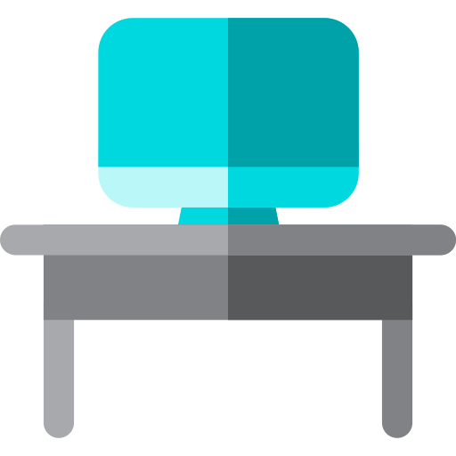

<h1>Hi there, I'm <a href="https://github.com/Dreezar" target="_blank">Vlad</a> 
</h1>
<h3></h3>
<ul>
<li> Learning HTML, CSS, JavaScript</li>
<li> I’m currently working on <a href="https://magnificent-truffle-02e42f.netlify.app/" target="_blank">AXIT</a> webpage</li>
<li> Ask me about GitHub</li>
</ul>

<h1>AXIT</h1>

This web page is created with the aim of mastering the basic principles of working with the HTML markup language and the CSS style language. The page is under development.

<h3>Technology's<h3>
<ul>
<li><a href="https://html5.org/" target="_blank">HTML5</a></li>
<li><a href="https://www.w3.org/Style/CSS/Overview.en.html" target="_blank">CSS3</a></li>
<li><a href="https://git-scm.com/" target="_blank">GIT</a></li>
</ul>

<h3>Tools<h3>
<ul>
<li><a href="https://code.visualstudio.com/" target="_blank">VSCode</a></li>
<li><a href="https://www.netlify.com/" target="_blank">Netlify</a></li>
</ul>

<h3>Accessibility<h3>

A11Y - none

<h3>Usage<h3>

To get to the site, just click on the link <a href="https://magnificent-truffle-02e42f.netlify.app/" target="_blank">AXIT</a>

<h3>Team<h3>
<ul>
<li>Uladzislau Razhko - Student </li>
<li>Yulya Vasilyeva - Front-End Dev Mentor</li>
</ul>